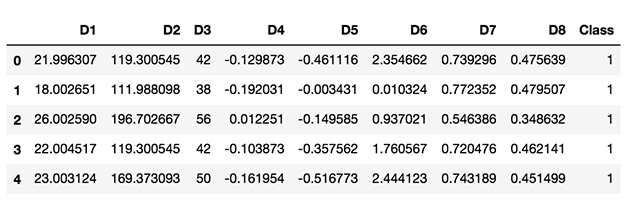

# Comparing classification algorithms for assignment of chemical compounds into different classes

 The goal of computer-aided drug design is identification of 
 novel compounds active against selected protein targets. In general, 
 all ligand-based virtual screening methods are based on the searching of 
 ligand similarity by comparison molecular structure descriptors and properties. 
 Here, I will show how to use chemical descriptor in categorising molecules 
 based on their biological functions. These features can classify compounds 
 that are diverse in substructure but nonetheless bind to the same 
 macromolecular binding sites, and can therefore be used to prepare molecular 
 databases for high-throughput and virtual screening.

 We will implement the most common classification algorithms in scikit-learn and
 compare their performance.

 The following algorithms will be compared:

 - Naive Bayes
 - Support Vector Machine
 - Logistic Regression
 - K-Nearest Neighbors
 - Linear Discriminant Analysis
 - Support Vector Machine
 - Decision Tree Classifier

 The dataset and chemical descriptors are described in my article [link.....], where 
 I used a linear discriminant analysis to assign chemical compounds into 7 different 
 classes.
 Here we will use a smaller dataset containing 45 molecules that are known to bind
 the cyclooxygenase 1 (COX1) enzyme, 59 molecules that bind HIV-1 protease and 41 molecules bind 
 Cytochrome C peroxidase enzyme.
 Our dataset has three classes and eight numeric input variables (chemical descriptors) of varying scales.

 Let's load an input data and print the first 5 elements. The molecules binding COX-1 enzyme have class label '1',
 the molecules binding HIV-1 protease have class label '2' and molecules binding Cytochrome C peroxidase enzyme has
 class label '3'. The eight chemical descriptors labeled as D1-D8.

```js
import pandas as pd
data = pd.read_csv('Dataset_COX-1_HIV-1_Cyt.csv')
data[0:5]
```


 So, let's create two variable X and Y. The X variable will contain all chemical descriptors and 
 Y will contain class labels.

```js
val = data.values
X = val[:,0:8]
Y = val[:,8]
```
 Let's train the model on 80% of the data and leave 20% for validation.
```js
from sklearn.model_selection import train_test_split
X_train, X_test, Y_train, Y_test = train_test_split(X, Y, test_size = 0.2, random_state = 650)
```
 Let’s start by importing required classifiers.
```js
from sklearn import model_selection
from sklearn.naive_bayes import GaussianNB
from sklearn.svm import SVC
from sklearn.linear_model import LogisticRegression
from sklearn.neighbors import KNeighborsClassifier
from sklearn.discriminant_analysis import LinearDiscriminantAnalysis
from sklearn.tree import DecisionTreeClassifier
from sklearn.metrics import confusion_matrix
```
 Let's prepare models, and train each model with a 10-fold cross-validation.
```js
seed = 15
models = []
names = []
results = []
scoring = 'accuracy'
models.append(('LR', LogisticRegression()))
models.append(('LDA', LinearDiscriminantAnalysis()))
models.append(('KNN', KNeighborsClassifier()))
models.append(('DT', DecisionTreeClassifier()))
models.append(('NB', GaussianNB()))
models.append(('SVM', SVC(kernel='linear')))
for name, model in models:
kfold = model_selection.KFold(n_splits=10, random_state=seed)
cross_val = model_selection.cross_val_score(model, X_train, Y_train, cv=kfold, scoring=scoring)
results.append(cross_val)
names.append(name)
msg = "%s: %f SD:%f" % (name, cross_val.mean(), cross_val.std())
print(msg)
```
LR: 0.948485 SD:0.058564
LDA: 0.990909 SD:0.027273
KNN: 0.965152 SD:0.058994
DT: 0.965909 SD:0.041804
NB: 0.965909 SD:0.041804
SVM: 0.957576 SD:0.042478

 As we can see LDA outperforms other models. Let's visualize the results of each model.
```js
import matplotlib.pyplot as plt
fig = plt.figure()
fig.suptitle('Algorithm Comparison')
ax = fig.add_subplot(111)
plt.boxplot(results)
ax.set_xticklabels(names)
plt.show()
```
